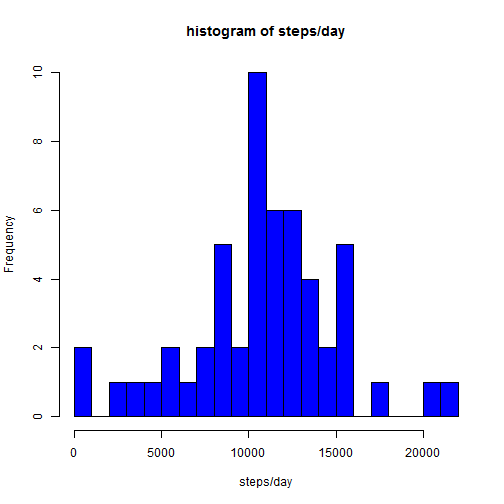
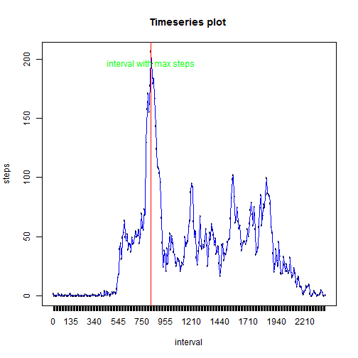
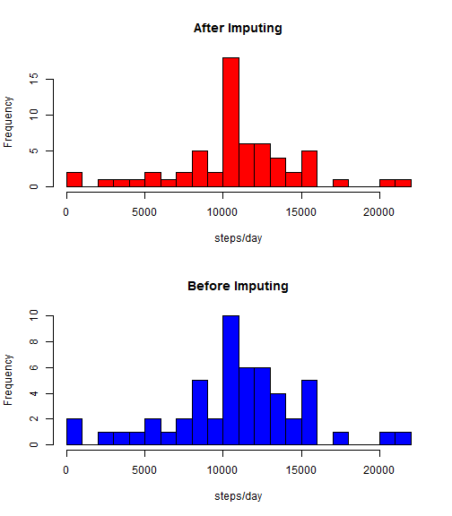
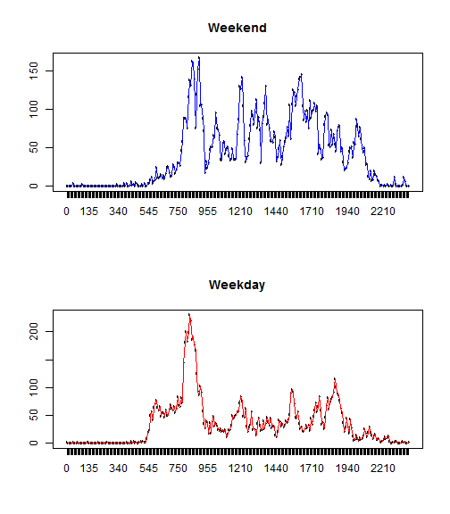

```r
library(knitr)
opts_chunk$set(warning = FALSE)
```


```r
setwd("C:\\Studies\\Coursera_Ds_reproducible research\\repdata_data_activity")
data = read.csv("activity.csv")
#removing NAs
good = complete.cases(data)
data1 = data[good,]
#Date
data1$date = as.Date(data1$date ,format = "%Y-%m-%d" ) 
#histogram
s = split(data1,data1$date)
steps_summary = as.data.frame(sapply(s,function(x) sum(x[,c("steps")])))
steps_summary = cbind(steps_summary , rownames(steps_summary))
colnames(steps_summary) = c("steps","date")
mean = mean(steps_summary$steps)
median = median(steps_summary$steps)
hist(steps_summary$steps,breaks = 20,col = "blue",xlab = "steps/day",main = "histogram of steps/day")
```

 

-The mean of totalNumberOfSteps/day is _1.0766 &times; 10<sup>4</sup>_

-The median of totalNumberOfSteps/day is _10765_


```r
s2 = split(data1,data1$interval)
interval_summary =as.data.frame(sapply(s2,function(x){mean(x[,c("steps")])}))
interval_summary = cbind(interval_summary , rownames(interval_summary))
colnames(interval_summary) = c("steps","interval")

interval_summary$interval = factor(interval_summary$interval, ordered=TRUE ,levels = as.character(sort(as.numeric(levels(interval_summary$interval)))))
maxInterval = interval_summary$interval[which.max(interval_summary$steps)]
plot(interval_summary$interval,interval_summary$steps,main = "Timeseries plot ",xlab = "interval",ylab ="steps")

lines(interval_summary$interval,interval_summary$steps,type="l",col = "Blue")
abline(v =  interval_summary$interval[which.max(interval_summary$steps)],col ="red")
text(y = max(interval_summary$steps)-10 , x=interval_summary$interval[which.max(interval_summary$steps)] ,"interval with max steps",col = "green" )
```

 


-From the graph we can infer that the interval with the highest number of steps is _835_
 


```r
#using the mean value in that interval
data12 = merge(data,interval_summary , by = "interval")
data12$date = as.Date(data12$date ,format = "%Y-%m-%d" ) 
data12 = data12[order(data12$date,data12$interval),]
data12[is.na(data12$steps.x),]$steps.x = data12[is.na(data12$steps.x),]$steps.y
data12 = data12[,c(1,2,3)]
colnames(data12) = c("interval","steps","date")
```


```r
s12 = split(data12,data12$date)
steps_summary12 = as.data.frame(sapply(s12,function(x) sum(x[,c("steps")])))
steps_summary12 = cbind(steps_summary12 , rownames(steps_summary12))
colnames(steps_summary12) = c("steps","date")
mean1=mean(steps_summary12$steps)
median1=median(steps_summary12$steps)
par(mfrow=c(2,1))
hist(steps_summary12$steps,breaks = 20,col = "red",xlab = "steps/day",main = "After Imputing")
hist(steps_summary$steps,breaks = 20,col = "blue",xlab = "steps/day",main = "Before Imputing")
```

 


-The mean of totalNumberOfSteps/day after imputing is _1.0766 &times; 10<sup>4</sup>_

-The median of totalNumberOfSteps/day after imputing is _1.0766 &times; 10<sup>4</sup>_

-Since we used the mean of the steps per interval for filling NA values,there is not much chnage in the mean and median.Only the frequency of values have changed in the histogram(as expected)


__Imputed Data__


```r
data12$day = ifelse(weekdays(data12$date)=="Saturday"|weekdays(data12$date)=="Sunday" ,"Weekend","Weekday")
#  library(xtable)
#  table = xtable(head(data12,5))
print(head(data12,6))
```

```
##     interval   steps       date     day
## 1          0 1.71698 2012-10-01 Weekday
## 63         5 0.33962 2012-10-01 Weekday
## 128       10 0.13208 2012-10-01 Weekday
## 205       15 0.15094 2012-10-01 Weekday
## 264       20 0.07547 2012-10-01 Weekday
## 327       25 2.09434 2012-10-01 Weekday
```


```r
s3 = split(data12[data12$day == "Weekend",],data12$interval)
s4 = split(data12[data12$day == "Weekday",],data12$interval)

graph = function(x,words ="weekend",col){
interval_summary12 =as.data.frame(sapply(x,function(x){mean(x[,c("steps")])}))
interval_summary12 = cbind(interval_summary12 , rownames(interval_summary12))
colnames(interval_summary12) = c("steps","interval")

interval_summary12$interval = factor(interval_summary12$interval, ordered=TRUE ,levels = as.character(sort(as.numeric(levels(interval_summary12$interval)))))
plot(interval_summary12$interval,interval_summary12$steps,main = words)
lines(interval_summary12$interval,interval_summary12$steps,type="l",col = col,xlab = "interval","steps")
}

par(mfrow=c(2,1))
graph(s3,"Weekend","Blue")
graph(s4,"Weekday","Red")
```

 
